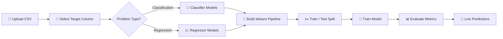

<div align="center">

<!-- Animated Banner -->


<br/>

<!-- Badges -->


<br/>

> **A no-code interactive machine learning platform built with Streamlit.**  
> Upload your dataset, configure preprocessing, pick a model, train it — and get predictions instantly.

<br/>

[🚀 Get Started](#-quick-start) • [✨ Features](#-features) • [📁 Project Structure](#-project-structure) • [🤝 Contributing](#-contributing)

</div>

---

## 🎯 What is ML Playground?

**ML Playground** is an end-to-end, interactive ML experimentation tool that removes the friction of writing boilerplate code. Whether you're a beginner exploring machine learning or a practitioner doing quick dataset experiments — this app lets you go from raw CSV to trained model in minutes.


Upload Data → Select Target → Configure Preprocessing → Choose Model → Train → Evaluate → Predict


---

## ✨ Features

| Feature | Description |
|---|---|
| 📂 **Data Upload** | Upload any CSV dataset directly in the browser |
| 🎯 **Target Selection** | Dynamically pick your target column from the sidebar |
| 🔁 **Problem Detection** | Switch between **Classification** and **Regression** tasks |
| 🔧 **Preprocessing** | One-Hot Encoding + StandardScaler / MinMaxScaler via pipelines |
| 🤖 **Model Selection** | Choose from multiple scikit-learn models with tunable parameters |
| 📊 **Evaluation** | Accuracy, RMSE, confusion matrix, and more — rendered instantly |
| 🔮 **Live Prediction** | Input values manually and get real-time model predictions |
| ⚡ **Modular Architecture** | Clean component-based structure — easy to extend |

---

## 🖥️ App Preview

(Refer the app)
https://ml-playground-o4et5sq2trbad2eawaoxmu.streamlit.app


---

## 📁 Project Structure

```
ML-Playground/
│
├── app.py                    # 🚀 Main Streamlit application entry point
├── requirements.txt          # 📦 Python dependencies
│
└── components/               # 🧩 Modular components
    ├── data_upload.py        # 📂 CSV file loading & preview
    ├── preprocessing.py      # 🔧 Feature encoding & scaling pipelines
    ├── model_training.py     # 🤖 Model selection & hyperparameter UI
    ├── evaluation.py         # 📊 Metrics, plots & evaluation reports
    └── prediction.py         # 🔮 Interactive prediction interface
```

---

## 🚀 Quick Start

### 1. Clone the Repository

```bash
git clone https://github.com/Sukhjas1314/ML-Playground.git
cd ML-Playground
```

### 2. Install Dependencies

```bash
pip install -r requirements.txt
```

### 3. Run the App

```bash
streamlit run app.py
```

The app will open at `http://localhost:8501` 🎉

---

## 📦 Tech Stack

```python
streamlit       # Interactive web UI framework
pandas          # Data loading and manipulation
scikit-learn    # ML models, pipelines, preprocessing & evaluation
```

---

## 🔧 How It Works



---

## 🤝 Contributing

Contributions, ideas, and pull requests are welcome!

```bash
# Fork the repo
# Create your feature branch
git checkout -b feature/AmazingFeature

# Commit your changes
git commit -m "Add AmazingFeature"

# Push to the branch
git push origin feature/AmazingFeature

# Open a Pull Request
```

---

## 📬 Connect

<div align="center">

[](https://github.com/Sukhjas1314)

</div>

---

<div align="center">


<sub>Built with ❤️ using Python & Streamlit</sub>

</div>
